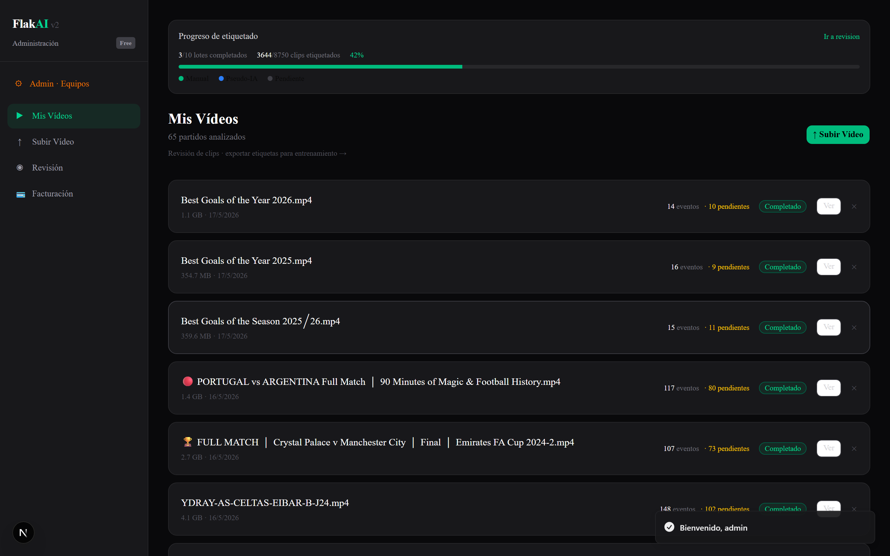
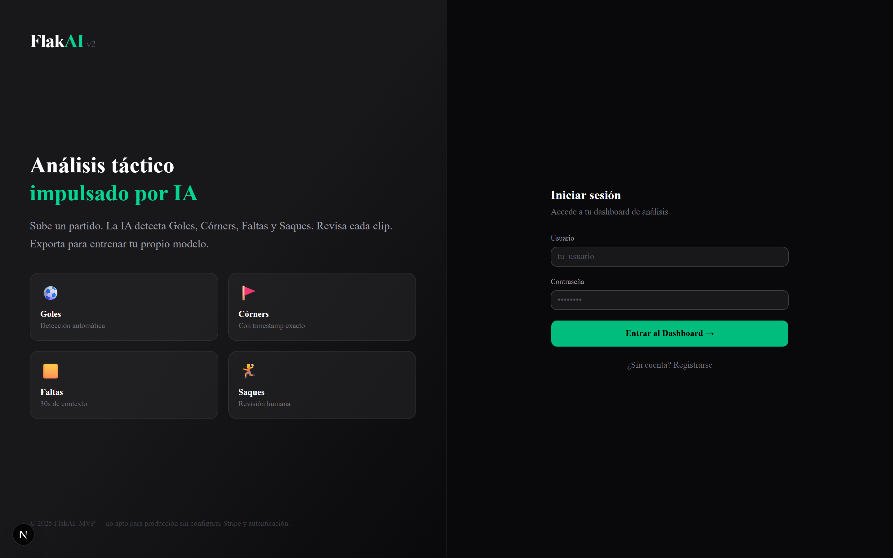
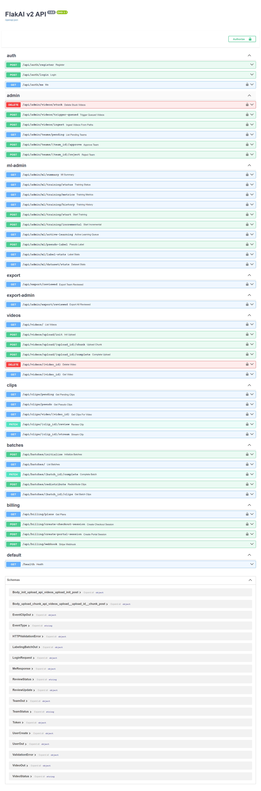
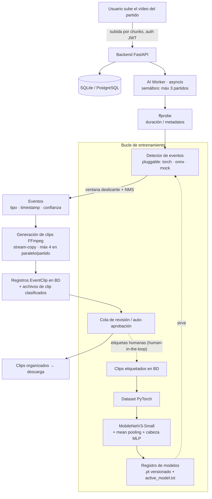

<div align="center">

[](https://github.com/NotSaam/FlakAI/stargazers) 

# ⚽ FlakAI

### Análisis Automático de Vídeo de Fútbol con IA

**Sube un partido completo → la IA detecta los eventos clave → recibes los clips, organizados y listos.**

Sin revisión manual. Sin rebobinar la línea de tiempo. Sin edición.

[]()
[]()
[]()
[]()
[]()
[]()
[]()
[]()

</div>

---

## ¿Qué es FlakAI?

Entrenadores, analistas y clubes graban partidos completos y luego pasan horas rebobinando para cortar
goles, córners, faltas y balones parados. **FlakAI elimina ese paso manual.**

Subes el vídeo del partido. Un *worker* de IA en segundo plano analiza la grabación completa, localiza
cada evento relevante con su marca de tiempo y un nivel de confianza, y FFmpeg corta un clip breve
alrededor de cada uno. Los clips vuelven clasificados por tipo de evento — listos para compartir,
revisar o montar un resumen.

```
partido_final/
├── goles/
│   ├── gol_00_23_14.mp4
│   └── gol_00_67_42.mp4
├── corners/
│   └── corner_00_08_33.mp4
├── faltas/
│   └── falta_00_34_19.mp4
├── disparos/
│   └── disparo_00_44_55.mp4
├── saques_banda/
│   └── saque_banda_00_12_01.mp4
└── saques_puerta/
    └── saque_puerta_00_19_40.mp4
```

---

## Capturas

**Dashboard** — subida de partidos, progreso de etiquetado en vivo y biblioteca de vídeos analizados.



| Inicio de sesión | API REST (Swagger) |
|:---:|:---:|
|  |  |

---

## El problema que resuelve

| Flujo manual | Con FlakAI |
|--------------|------------|
| El analista ve 90 min para encontrar ~30 momentos | Subes una vez y te olvidas |
| Corte y nombrado de archivos a mano | Clips cortados y nombrados con timestamp automáticamente |
| Lento, inconsistente, propenso a errores | Pipeline repetible, con confianza por evento |
| Un partido cada vez | Varios partidos / equipos en paralelo |

**Valor:** convierte horas de edición de vídeo post-partido en un paso desatendido de subir y recoger.

---

## Arquitectura



---

## Componentes principales

| Componente | Ubicación | Qué hace |
|------------|-----------|----------|
| **AI Worker** | `backend/ai_worker.py` | Procesado async en segundo plano, semáforo de concurrencia (máx 3 partidos) |
| **Detector de eventos** | `backend/detection/` | Backend pluggable (`torch` / `onnx` / `mock`) vía `factory.py` — cambiar motor sin tocar el worker |
| **Generador de clips** | `backend/clip_generation.py` | FFmpeg stream-copy, hasta 4 cortes en paralelo por partido, sin recodificar |
| **Modelo** | `training/model.py` | Backbone MobileNetV3-Small + mean pooling + cabeza MLP (7 clases) |
| **Pipeline de entrenamiento** | `training/train.py`, `dataset.py`, `evaluate.py` | Entrena desde clips etiquetados en BD; soporta entrenamiento incremental |
| **Registro de modelos** | `models/` | Checkpoints versionados (`event_classifier_v*.pt`), `active_model.txt`, `training_status.json` |
| **Watcher de auto-ingesta** | `backend/auto_ingest_watcher.py` | Modo servidor: vigila una carpeta local y procesa vídeos nuevos sin interfaz |
| **Facturación** | `backend/billing/` | Planes Stripe (`free_trial`, `pro`, `club`) |
| **Dashboard** | `frontend/` | Next.js 14 + Tailwind + Shadcn UI — subida, progreso en vivo, descarga |

---

## Características

- 🎯 **Detección automática de eventos** — análisis del partido completo con timestamp + confianza por evento
- ⚡ **Extracción paralela con FFmpeg** — stream-copy (sin recodificar) para cortes rápidos, hasta 4 en paralelo
- 🗂️ **Clasificación de eventos** — 7 clases: gol, córner, saque de banda, falta, saque de puerta, disparo a puerta, negativo
- 🔌 **Backend de detección pluggable** — `torch` / `onnx` / `mock`, elegido por variable de entorno, sin tocar el worker
- 🔁 **Procesado en segundo plano** — sube y cierra el navegador; el worker termina y guarda los resultados
- 👥 **Multi-equipo / multi-usuario** — datos aislados por equipo
- 🧠 **Modelos versionados + bucle de entrenamiento** — checkpoints reproducibles, reentrenamiento incremental
- 🧑‍⚖️ **Cola de revisión human-in-the-loop** — los clips aceptados/rechazados alimentan el siguiente entrenamiento
- 💳 **Facturación Stripe** — Checkout, Webhooks, Portal de cliente
- 📁 **Modo auto-ingesta** — watcher de carpeta sin interfaz para despliegues en servidor

---

## Casos de uso

- **Análisis de partidos para entrenadores y analistas** — clips de eventos al instante tras cada partido
- **Gestión de grabaciones de club / cantera** — procesar una temporada entera por lotes
- **Resúmenes y contenido para redes** — extraer goles y disparos sin un editor de vídeo
- **Volante de datos (data flywheel)** — la cola de revisión convierte el uso en datos de entrenamiento
- **Puente investigación → producción** — un pipeline ML real con versionado, evaluación y serving

---

## El modelo

Clasificador de clips entrenado sobre **clips reales de partidos etiquetados a mano**.

- **Arquitectura:** MobileNetV3-Small + mean pooling temporal + cabeza MLP
- **Clases (7):** gol, córner, saque de banda, falta, saque de puerta, disparo a puerta, negativo
- **Entrenamiento:** GPU AMD/Intel vía **DirectML (DirectX 12)**, versionado de checkpoints
- **Inferencia:** ventana deslizante + NMS temporal; cada evento con timestamp y confianza
- **Serving:** modelo activo resuelto por `active_model.txt`, exportable a **ONNX**

Ruta de evolución documentada en [`docs/model-upgrade-plan.md`](docs/model-upgrade-plan.md): attention
pooling → EfficientNet-B2 → pooling temporal (LSTM/Transformer), cada paso condicionado al tamaño del dataset.

---

## Inicio rápido

### Requisitos
- Python 3.11+
- Node.js 18+
- [FFmpeg](https://ffmpeg.org/download.html) en el PATH

### Arranque en un comando (Windows)
```powershell
.\start.ps1
# Backend  → http://localhost:8000
# Frontend → http://localhost:3000
# API docs → http://localhost:8000/docs
# Login    → admin / admin
```

### Backend (manual)
```powershell
cd backend
python -m venv venv; venv\Scripts\activate
pip install -r requirements.txt
python seed_admin.py        # solo la primera vez
uvicorn main:app --reload
```

### Frontend (manual)
```powershell
cd frontend
npm install
npm run dev
```

### Entrenar / evaluar el modelo
```powershell
cd training
training_venv\Scripts\activate
python train.py --epochs 20 --lr 0.001 --batch-size 8 --device auto
python evaluate.py
python export_onnx.py        # exportar a ONNX para serving
```

---

## API REST

Documentación interactiva en `http://localhost:8000/docs`.

```
POST   /api/auth/register        Registro de usuario
POST   /api/auth/token           Login → JWT
GET    /api/videos/              Listar partidos
POST   /api/videos/upload        Subir partido (procesado automático)
GET    /api/videos/{id}/status   Estado del procesado y progreso
GET    /api/clips/               Listar clips generados
GET    /api/clips/{id}/download  Descargar un clip
GET    /api/billing/plans        Planes de suscripción
POST   /api/billing/checkout     Sesión de pago Stripe
GET    /api/admin/ml             Admin ML (control de entrenamiento)
```

---

## Próximas mejoras

- 📁 Carpetas de salida organizadas por evento + descarga ZIP en un clic
- 📈 Crecer y rebalancear el dataset para subir la precisión por clase
- 🧠 Attention pooling → backbone EfficientNet-B2
- 🎚️ Calibración de confianza (que "90% de confianza" signifique ~90% de precisión)
- ⚙️ Cola de trabajos (Celery/RQ) + PostgreSQL + almacenamiento de objetos para escalar

Ver [`docs/ml-roadmap.md`](docs/ml-roadmap.md) y [`docs/scaling.md`](docs/scaling.md).

---

## Autor

**NotSaam** — ingeniería full-stack y ML (backend, frontend, pipeline de entrenamiento, modelo, infra).

## Licencia

Copyright © 2026 NotSaam. Todos los derechos reservados.
Queda prohibida la reproducción, distribución o modificación de este software, total o parcial, sin
autorización expresa y por escrito del autor.
